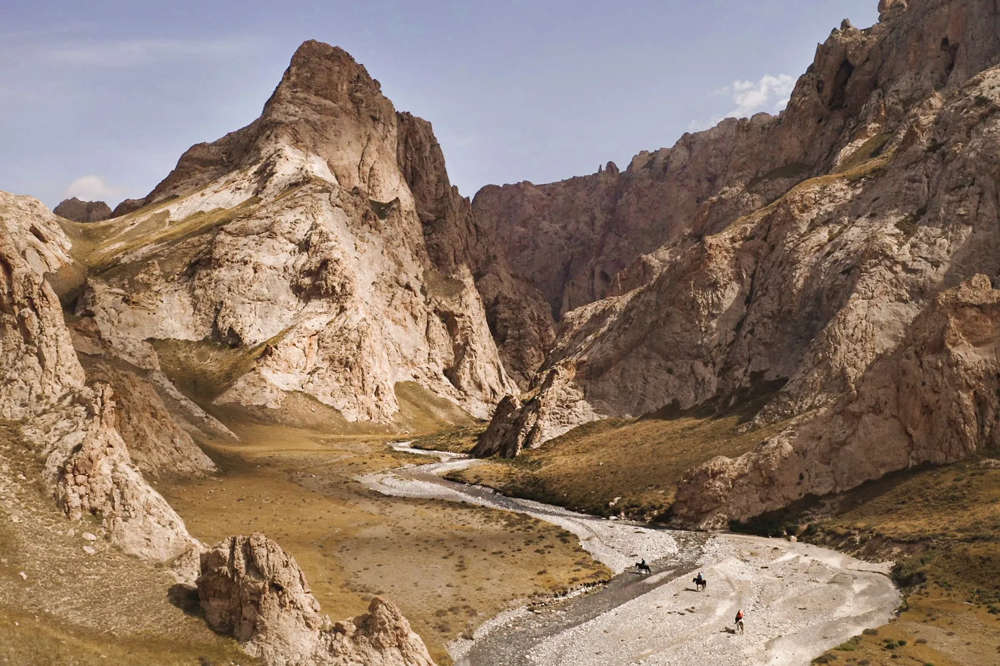

# Spatial Visualizer

A browser-based 3D viewer for spatial mapping data from the [Uncharted Caves of Kyrgyzstan](https://martinedstrom.com/projects/uncharted-caves-of-kyrgyzstan/) expedition. You can explore drone photogrammetry of the Axay Uru Valley in the Tian Shan mountains on desktop or mobile, with no install needed.

**Live site:** [kyrgyzcaves.edstrom.photo](https://kyrgyzcaves.edstrom.photo)



## What's in here

| Page | Status | Description |
|------|--------|-------------|
| `/` | ✅ Live | Landing page with project intro and links to each viewer |
| `/pointcloud.html` | ✅ Live | 262k-point cloud with vertex colors and a 1 km reference grid |
| `/mesh.html` | 🔜 Planned | Textured mesh reconstruction |
| `/splat.html` | 🔜 Planned | Gaussian splat rendering |

The long-term goal is to support point clouds, meshes and Gaussian splats in the browser, and VR through WebXR.

## How it's made

- **Vite** for the dev server and build, configured for multi-page output
- **React** + **React Three Fiber**, a declarative scene graph on top of Three.js
- **@react-three/drei** for orbit controls, GLB loading and other helpers
- **Three.js** for WebGL rendering with vertex colors
- GLB models in `public/models/`, served as static files

## Getting started

Requires Node.js 20.19+ (or 22.12+).

```bash
npm install
npm run dev
```

Open `http://localhost:5173` for the landing page, or go straight to `http://localhost:5173/pointcloud.html`.

The dev server listens on your local network as well, so you can test on a phone on the same Wi-Fi using the **Network** URL that Vite prints.

Other scripts:

```bash
npm run build     # production build into dist/
npm run preview   # serve the production build locally
npm run lint      # ESLint
```

## Project structure

```
index.html              ← Landing page (static HTML, no React)
pointcloud.html         ← Point cloud viewer entry
src/
  pointcloud.jsx        ← Point cloud React entry point
  App.jsx               ← Scene, controls, UI overlay and model registry
  PointCloudModel.jsx   ← GLB loader: enables vertex colors, centers and scales the model
  ScaleGrid.jsx         ← 1 km × 1 km ground grid for scale reference
  index.css             ← Global styles
public/
  models/               ← GLB model files
  img/                  ← Hero / social preview image
vite.config.js          ← Multi-page Vite configuration
.github/workflows/      ← Build and deploy to Cloudflare Pages
```

## Adding a model or page

1. Put the model file in `public/models/`.
2. Add an entry to the `MODELS` array in [`src/App.jsx`](src/App.jsx) with an `id`, `label`, `url` and the component that renders it.
3. For a new standalone page, add an HTML entry (for example, `mesh.html`) and register it under `build.rollupOptions.input` in [`vite.config.js`](vite.config.js).

The model loader assumes GLB units are meters. The scale grid relies on this.

## Deployment

Every push to `main` triggers [`.github/workflows/deploy.yml`](.github/workflows/deploy.yml), which builds the site and deploys `dist/` to Cloudflare Pages. Pull requests from branches in this repo get a preview deployment. The workflow needs two repository secrets, `CLOUDFLARE_API_TOKEN` and `CLOUDFLARE_ACCOUNT_ID`. Workflows triggered from forks don't get these secrets.

## Data

The 3D data comes from drone flights and photogrammetry carried out during the expedition in the Tian Shan mountains of Kyrgyzstan. The team used these models to scout terrain in the field and to find previously unrecorded cave systems. The data now supports scientific analysis, storytelling, and conservation work toward a protected geopark in the Kok-Kiya region.

Read more about the expedition at [martinedstrom.com](https://martinedstrom.com/projects/uncharted-caves-of-kyrgyzstan/).
